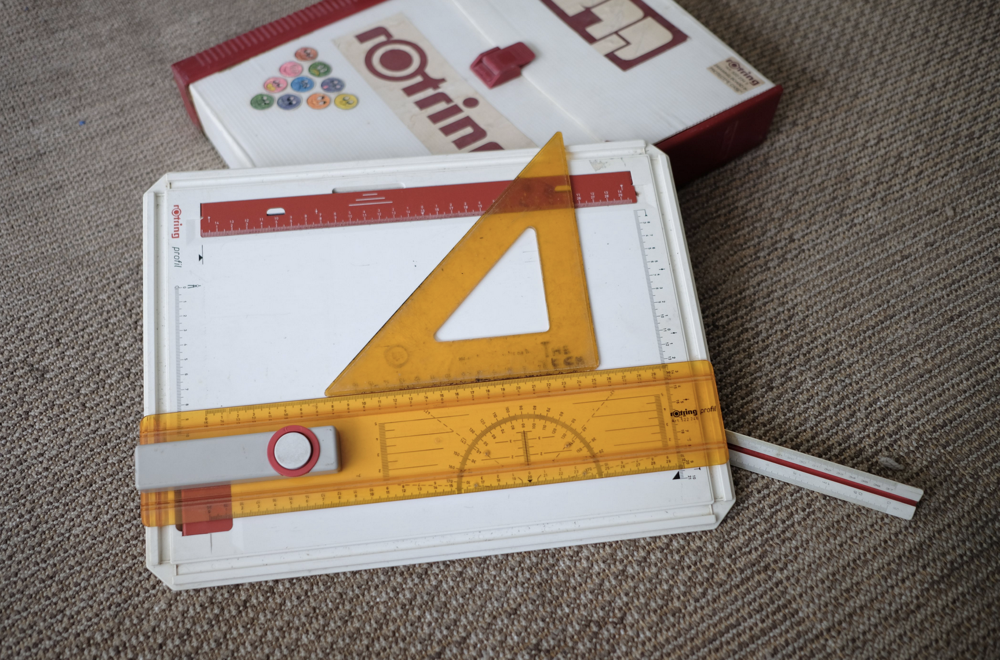
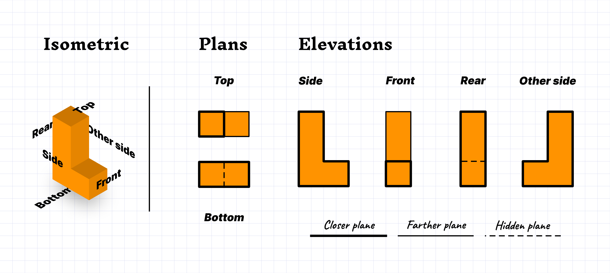
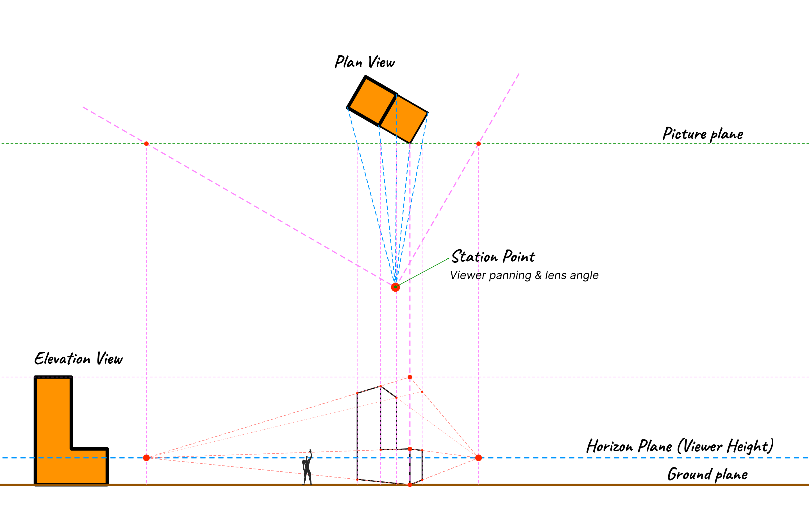
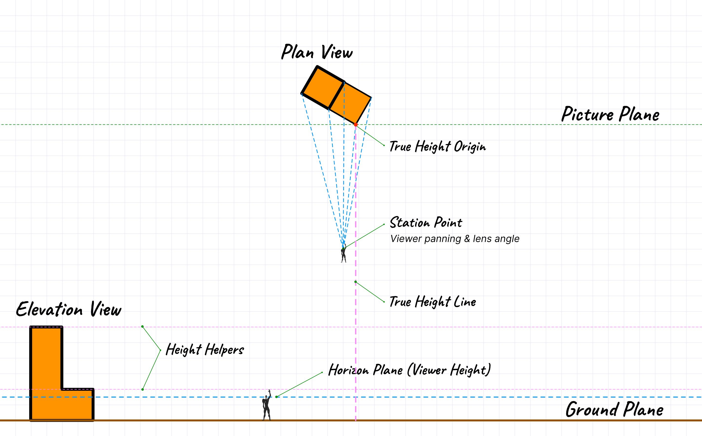
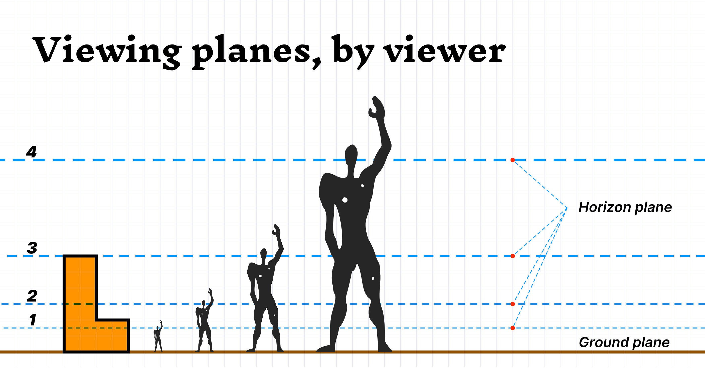

import LShape from '~/components/forPosts/LShape.vue'

## Why do perspective

As a young kis my big brother studied engineering thingies at Secondary school – his homework was to draw 3 dimensional shapes out of plans, and I used to observe him amazed while he did this isometric tricks – drawing 3d objects from plans by using simple tools; some rules, pencils and a sheet of paper. Him creating these shapes looked like magic – and as a good monkey I've immediately started to imamate – the amazing thing was that I was able the recreate the magic and it felt awesome!

*My old school drawing tools*

Along the years I've studied a *Practical Engineer Degree* in architecture and have fiddled around with 3D computer graphics – so I've homed my skills a bit further. But that was a long time ago and my 3D days are but a faded memory – or are they?! So I took out my drawing tools and started at it and failed miserably 😞 

What's a boy to do? I've *DuckDuckWent* it and a few days later I've had a proper drawing done ✍️ In order to not forget it I had this article done, in which we'll draw a simple shape using the **laws** of perspective. If by this article you'll know how to do these perspective drawing manually – with physical tools – or digitally, in this case, with *Affinity Designer* – it will be a great success!

!> The **Law** in the of laws of perspective means that there's a way to *precisely* reproduce the same view by using the same parameters – for you to set your oun views by demand, to *accurately* compose a perspective and to create plans for other to read and use. 

> BTW, ever wondered what's the difference between *accuracy* and *precision*? Then check out [this video by Matt Anticole](https://youtu.be/hRAFPdDppzs)

## Overview

When modeling 3D objects like house or a chair – designers and engineers use 2d drawings for simplicity sake, to visually communicate how things function or constructed – these drawings are called a blueprints or floor plans, and they can have many views.For this article we'll use the **top** & **bottom** view *(Plans)* and the **side/rear/front** and **other side** views *(Elevations)*. 

For this example let's choose a simple shape we probably all know from the game of *Tetris* (which I've spent too much time playing as a kid). I'll use will be the `L` tetrimino – In the image below we can see all of the shape's views *(blueprint)* + an isometric view to explain the views with ease.  

*The L Block Tetrimino Views*

Before we get started – in the image below you can see how a finalized layout looks like, so you get a better idea of the project's scope. I've also marked the terms we'll be working and have listed them in the footnotes [^detailed-list].

 *An end result perspective drawing*

## Let's Start

To get our perspective drawing going we'll need 2 views – a *Plan*[^1] and an *Elevation*[^2]. The elevation view will help us find the heights of an object and the plan view will help us with everything else. 

- The *Elevation view* goes on the *Ground Plane* [^3] – Choose a view the holds most of the information in the clearest way
- This is the time to place the *Horizon Plane* [^4] – that is the viewer height. In this drawing, the object is roughly 3 times the size of the viewer. 
> Changing the viewer height will not change the output size, but the viewing angel. To change the output size you'll to use need smaller views.
- Form the *Elevation view* you can pull out the *Height Helpers* [^5]
- The Plan view goes on the top of the layout, adjacent to the *Picture Plane* [^6]. 
  - Make sure to leave enough space for the next step
  - Rotating the plan view will result with a rotated 3d view
- Now let's place the *Station Point* [^7]. I'll place it smack in the middle for a mild perspective with a slight pan to left. 
- I'll keep the *Plan* view edge tangent to the *Picture Plane*, this point will 

*The Basic layout*

## The viewing planes - Height planes

These plans are using the elevation views

*Viewing planes by viewer*

# The 3D world

This is where the flat views, the *plan* and the *elevation*, meet each other to create the 3d view. 

What is we'd like to draw the object large or small, see it through a wide or narrow lens This planes with 

### Picture plane

Line crossing the picture plane will be used to measure the true height

### Viewing height

Will start wh

### Station point - Distance, width and position

Is up to you where to place the Station point 

The station point is the distance of the viewer from the object. The closer the Station point to the object is the wider the image will be, and the other way around - the further away - the narrower it will turn out.

### Positioning

# Links

[3 point perspective tutorial.](http://www.automotiveillustrations.com/tutorials/drawing-3-point-perspective.html)
  

<LShape 
:show-comp-scale="true" 
:show-comp-pres="true"
:show-comp-rot-y="true"
:show-comp-axle-y="true"
/>

---

[^detailed-list]: Our perspective drawing with all of the terms in use 

[^1]: ***Plan View*** – View from top or bottom

[^2]: ***Elevation View*** – View from whichever side

[^3]: ***Ground Plane*** – As the name suggest, this is the ground and the base of the drawing. The object can elevate above the ground and below it the viewer probably won't see it

[^4]: ***Horizon Plane*** – This is the viewer's eye level – How tall the viewer is in relation the the object – BTW, it can be below the *Ground plane*

[^5]: ***Height Helpers*** – You'll draw them from the Elevation and they set the height of the element

[^6]: ***Picture Plane*** – This is where the magic happens – where we flip the 2D and the 3D worlds 😲 My recommendations; place it in the front or middle of the shape – meddling with it will produce undesirable outputs 

[^7]: ***Station Point*** – This will produce the perspective affect and they panning left or right. In a counter intuitive kinda way, having this point closer or further away will not make the object bigger or smaller – but like a camera lens – it will make the view *Wider* or *Narrower*.  
- ***Vanishing Points*** – This points will derive form your setup – You'll figure them up by using the *VP Helpers* and *VP Crossing*
- ***Picture Lines*** – Lines you'll draw from the *Station Point* to the object's edges, their crossing (***Picture Plane Crossing***) with the *Picture Plane* will produce the *Projection Lines* and the *True Height Origin*
- ***Projection Lines*** – Parallel lines you'll draw from the *Picture Plane Crossing* to the *Ground Plane*.  
- ***True Height Origin & Line*** - This is just another *Projection Line* that its origin is tangent to the *Picture Plane* – The line itself is used to measure an object true height using the *Elevation View* and the *Height Helpers*

For you to make it freehand - and though the precision levels will drop it will still be accurate.

!> Use the views the holds most of the information in the clearer way - For the simple shape it doesn't really matter - As long as we use a ***Plan*** and an ***Elevation***