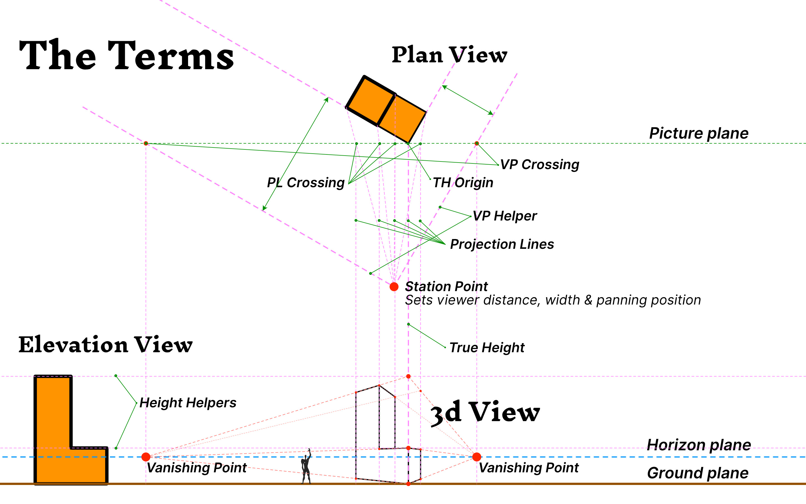
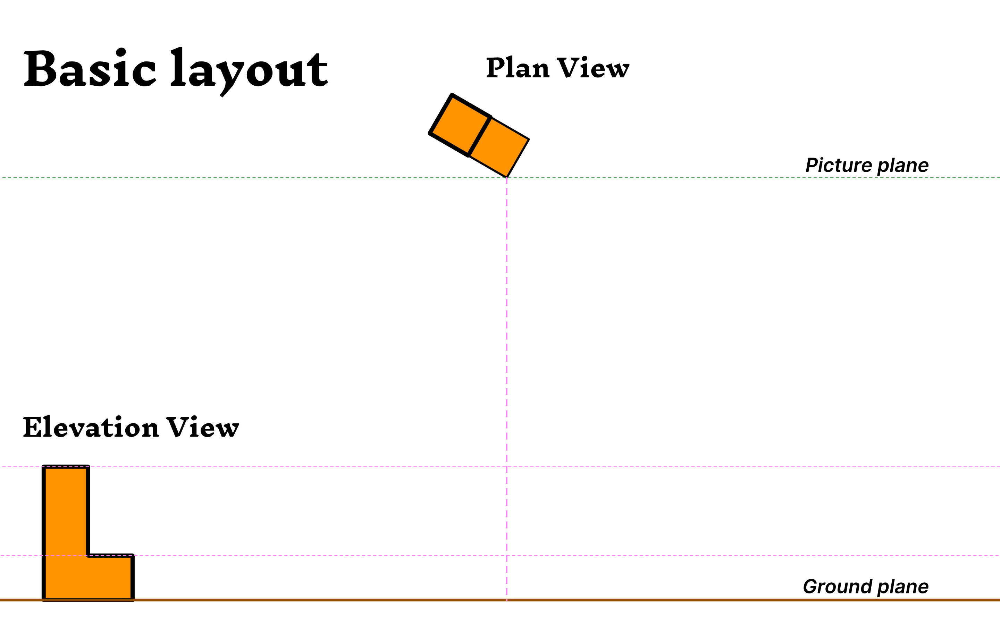

import LShape from '~/components/forPosts/LShape.vue'

<LShape/>

## Why do perspective

As a young kis my big brother studied engineering thingies when he was at Secondary school – his homework was to draw 3 dimensional shapes out of plans, and I used to observe him amazed while he did this isometric tricks – drawing 3d objects from plans by using simple tools; some rules, pencils and a sheet of paper. Him creating these shapes looked like magic – and as a good monkey I've immediately started to imamate – the amazing thing was that I was able the recreate the magic and it felt awesome!

*My old school drawing tools*

Along the years I've studied a *Practical Engineer Degree* in architecture and have fiddled around with 3D computer graphics – so I've homed my skills a bit tougher. But that was a long time ago and my 3D days are but faded memory – or was it?! 

I've taken out my tools and started drawing – I failed miserably 😞 So I've DuckDuckWent it and a few days later I've had a proper drawing done – and in order to not forget it I had this article done!

So, in this article we'll draw a simple shape using the laws of perspective. The **Law** in the of laws of perspective means that there's a way to *precisely* reproduce the same view by using the same parameters – for you to set your oun views by demand, to *accurately* compose a perspective and to create plans for other to read and use. If by this article you'll know how to do these perspective drawing manually with physical tools or digitally, like in this case, with *Affinity Designer* – it will be a great success!

> Ever wondered what's the difference between *accuracy* and *precision*? Then check out [this video by Matt Anticole](https://youtu.be/hRAFPdDppzs)

## Overview

For this example let's choose a simple shape we probably all know from the game of *Tetris* (which I've spent too much time playing as a kid). I'll use will be the `L` tetrimino – In the image below we can see all of the shape's views *(blueprint)* + an isometric view to explain the views with ease.  

*The L Block Tetrimino Views*

Before we get started – in the image below you can see how a finalized layout looks like, so you get a better idea of the project's scope. I've also marked the terms we'll be working and have listed them below the image – dividing into to *2D* and *3D* worlds.

 *A basic layout for creating a perspective drawing with all of the terms in use*

# The 2D world

When modeling 3D objects like house or a chair – designers and engineers use 2d drawings for simplicity sake, to visually communicate how things function or constructed – these drawings are called a blueprints or floor plans, and they can have many views.For this article we'll use the **top** & **bottom** view *(Plans)* and the **side/rear/front** and **other side** views *(Elevations)*. 

## A basic layout

Let's review a basic layout to get a perspective drawing going -  To make a perspective we'll need 2 views - a ***Plan*** and an ***Elevation***. The elevation view will help us find the true heights of an object, the plan view will help us with everything else.

Rotating the plan view will result with a rotated 3d view 😉

*The Basic layout*

Use the views the holds most of the information in the clearer way - For the simple shape it doesn't really matter - As long as we use a ***Plan*** and an ***Elevation***

## The viewing planes - Height planes

These plans are using the elevation views

- **Ground plane** - As the name suggest, this is the ground and the base of the drawing
- **Horizon plane** - This is the viewer's eye level - In a counter intuitive kinda way, if you'de like to draw a **smaller** object then place the Horizon plane **higher** then the elevation view, and the other way around to draw a bigger object. The following fig *(Viewing planes, by object)* shows it nicely

*Viewing planes by viewer*

# The 3D world

This is where the flat views, the *plan* and the *elevation*, meet each other to create the 3d view. 

What is we'd like to draw the object large or small, see it through a wide or narrow lens This planes with 

### Picture plane

Line crossing the picture plane will be used to measure the true height

### Viewing height

Will start wh

### Station point - Distance, width and position

Is up to you where to place the Station point 

The station point is the distance of the viewer from the object. The closer the Station point to the object is the wider the image will be, and the other way around - the further away - the narrower it will turn out.

### Positioning

# Links

[3 point perspective tutorial.](http://www.automotiveillustrations.com/tutorials/drawing-3-point-perspective.html)
  

---
---
---
---

For you to make it freehand - and though the precision levels will drop it will still be accurate.

#### The 2D world

- Plan view
- Elevation view
  
    - Height Helpers

- Ground plane
- Horizon plane

#### The 3D world

- Picture plane
- Station Point
- Vanishing Points
  
    - VP Helper
    - VP Crossing

- Projection Lines
  
    - PL crossing

- True Height
  
    - TH origin
